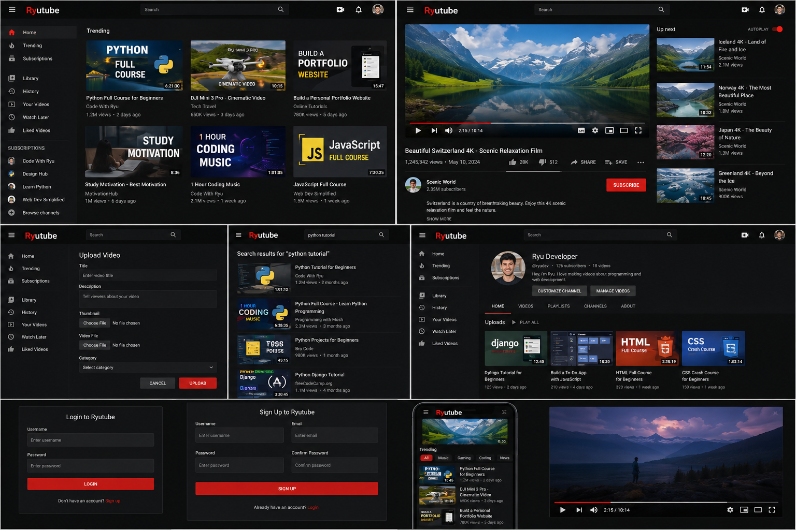

🚀 Ryutube is a full-stack YouTube-inspired video sharing platform built using Django, HTML, CSS, and JavaScript. 🎥 Users can upload videos, stream content, search trending videos, like and comment on posts, and manage their own dashboard. Designed with a modern red-black UI 🖤❤️ and local media storage support for a smooth experience.

 
